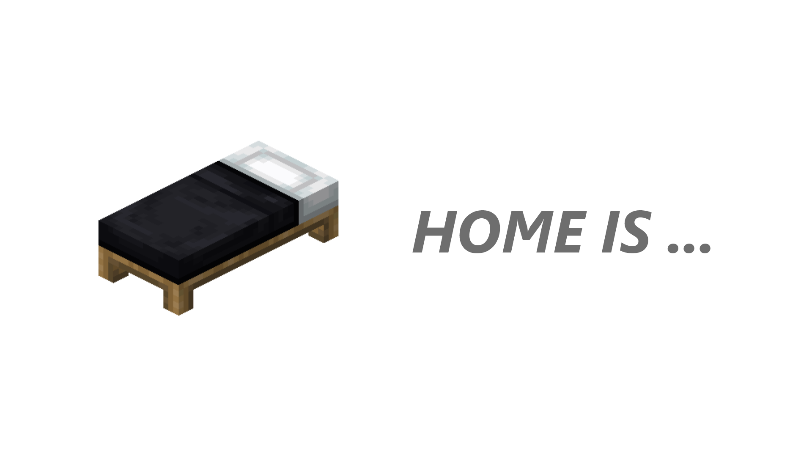

# 

## Lightweight home controller provider for forge

### Explore

#### [Download mod](https://github.com/ProjectEssentials/ProjectEssentials-Home/releases/download/v1.14.4-1.1.2/Project.Essentials.Home-1.14.4-1.1.2.jar) · [How to install](https://mairwunnx.gitbook.io/project-essentials/project-essentials-home#how-to-install) · [Commands](https://mairwunnx.gitbook.io/project-essentials/project-essentials-home#commands-and-permissions) · [Configuration](https://mairwunnx.gitbook.io/project-essentials/project-essentials-home#configuration) · [Troubleshooting](https://github.com/ProjectEssentials/ProjectEssentials-Home/issues/new/choose) · [CurseForge](https://www.curseforge.com/minecraft/mc-mods/ProjectEssentials-Home) · [Change log](changelog.md)

### Compatibility

This mod branch supported forge version `28.0.X` and `28.1.X` (Minecraft `1.14.4`).

### Credits

- Author: Pavel Erokhin [@mairwunnx](https://github.com/mairwunnx)
- [JetBrains](https://www.jetbrains.com/) for Licenses

